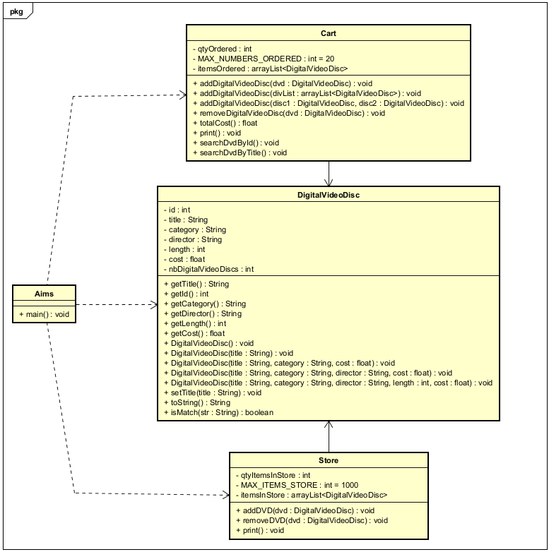

# LAB04

## AIMS Project

### Source Files
- **[Aims.java](https://github.com/pikasonix/Lab03/blob/release/lab04/Lab03/Lab02/AimsProject/src/hust/soict/dsai/aims/Aims.java)**

  `Lab03/Lab02/AimsProject/src/hust/soict/dsai/aims/Aims.java`

- **[media package](https://github.com/pikasonix/Lab03/blob/release/lab04/Lab03/Lab02/AimsProject/src/hust/soict/dsai/aims/media/)**

  `Lab03/Lab02/AimsProject/src/hust/soict/dsai/aims/media/`

- **[Cart.java](https://github.com/pikasonix/Lab03/blob/release/lab04/Lab03/Lab02/AimsProject/src/hust/soict/dsai/aims/cart/Cart.java)**

  `Lab03/Lab02/AimsProject/src/hust/soict/dsai/aims/cart/Cart.java`

- **[Store.java](https://github.com/pikasonix/Lab03/blob/release/lab04/Lab03/Lab02/AimsProject/src/hust/soict/dsai/aims/store/Store.java)**

  `Lab03/Lab02/AimsProject/src/hust/soict/dsai/aims/store/Store.java`

---

## Answers

- **[answers.txt](https://github.com/pikasonix/Lab03/blob/release/lab04/Lab03/Lab02/answers.txt)**

  `Lab03/Lab02/answers.txt`

---

## UML Diagram

- **Class Diagram**  
  
